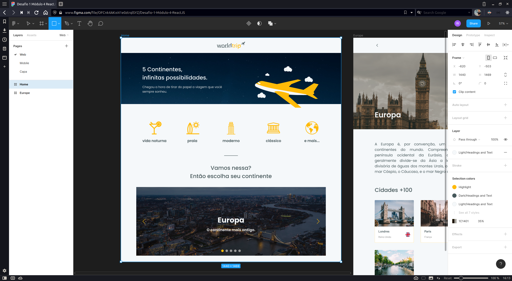

# Worldtrip

Uma aplicação web responsiva de uma empresa (fictícia) de viagens, desenvolvida utilizando o Next.js e o ChakraUI para a estilização dos componentes.

## Layout do Figma

A interface da aplicação foi baseado no layout do Figma que pode ser acessado por meio [deste link](https://www.figma.com/file/OFCnk4AKxi41e0ztrqlSYZ/Desafio-1-M%C3%B3dulo-4-ReactJS?node-id=14%3A135).

